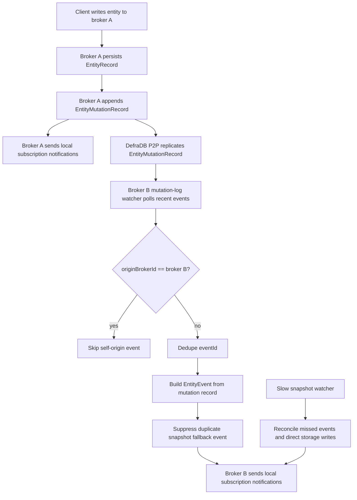

# Leona Context Broker

`leona_context_broker` is modular NGSI-LD Context Broker written in Rust with `actix-web`.

Current runtime pieces:

- `actix-web` for HTTP API
- DefraDB GraphQL endpoint for persisted entities, temporal entities, and subscriptions
- direct local HTTP delivery for subscription notifications
- replicated entity mutation log for near-realtime cross-node notification fan-out

The codebase is being aligned to the ETSI NGSI-LD API surface:

- https://cim.etsi.org/NGSI-LD/official/front-page.html
- https://forge.etsi.org/rep/cim/ngsi-ld-openapi/-/raw/v1.8.1/openapi-3.0.3/ngsi-ld-api.yaml

This repository no longer uses in-memory-only storage. It now uses DefraDB-backed repositories plus split module layout, but still is not fully ETSI-complete. See `IMPLEMENTATION_STATUS.md` for current implemented vs missing list.

## Modules

- `src/api.rs`: Actix route wiring
- `src/app`: shared application state
- `src/context`: tenant, `Via`, and `Link` header handling
- `src/domain`: persisted document, mutation-log, and result types
- `src/persistence`: repository traits plus DefraDB and in-memory implementations
- `src/query`: entity and temporal query DTOs plus backend-neutral query planning
- `src/services`: entity, temporal, subscription, notification, and discovery logic
- `src/utils`: JSON and time helpers

## How It Works

At runtime the broker handles each request in four layers:

1. `src/api.rs` maps HTTP routes under `/ngsi-ld/v1` to service functions and normalizes request metadata.
2. `src/context/headers.rs` extracts `NGSILD-Tenant`, `Link`, and `Via`. `Link` can backfill `@context`; `Via` remains available for internal broker-to-broker metadata.
3. `src/services/*` performs validation, applies NGSI-LD semantics, persists state locally, and triggers side effects.
4. `src/persistence/defradb.rs` stores wrappers such as `{ tenant, id, doc }` plus replicated mutation records in DefraDB GraphQL collections.

Write flow:

- persist entity/temporal/subscription locally in DefraDB
- append `EntityMutationRecord` for entity writes
- deliver matching local subscription notifications inline when applicable
- remote brokers consume replicated `EntityMutationRecord` rows and deliver their own local subscriptions
- large `entityOperations/create` requests also fan out committed entity snapshots to configured peer brokers to keep bulk data convergence bounded while DefraDB P2P catches up

Read flow:

- query local DefraDB-backed records first using filters built in `src/query/planner.rs`
- apply output projection (`normalized`, `keyValues`, `GeoJSON`, temporal formats) before returning the response

## Cross-Node Notification Logic

The broker does not use DefraDB internal PubSub as an application API. DefraDB P2P still replicates data, but the broker consumes an explicit replicated mutation log that is stable and shaped for NGSI-LD notifications.



Runtime behavior:

- `EntityMutationRecord` is replicated between DefraDB nodes together with `EntityRecord`.
- Fast watcher polls mutation records every `BROKER_ENTITY_EVENT_WATCH_INTERVAL_MS` milliseconds, default `100`.
- Snapshot watcher remains enabled as a slower correctness fallback, default `30000` milliseconds.
- Subscription records stay local; only each broker's local subscriptions are evaluated.
- Delete events carry the removed entity payload in the mutation log, so remote brokers can notify without waiting for snapshot absence.

## Implemented Routes

- `POST /ngsi-ld/v1/entities`
- `GET /ngsi-ld/v1/entities`
- `GET /ngsi-ld/v1/entities/{entityId}`
- `DELETE /ngsi-ld/v1/entities/{entityId}`
- `PATCH /ngsi-ld/v1/entities/{entityId}`
- `PUT /ngsi-ld/v1/entities/{entityId}`
- `POST /ngsi-ld/v1/entities/{entityId}/attrs`
- `PATCH /ngsi-ld/v1/entities/{entityId}/attrs`
- `PATCH /ngsi-ld/v1/entities/{entityId}/attrs/{attrId}`
- `DELETE /ngsi-ld/v1/entities/{entityId}/attrs/{attrId}`
- `PUT /ngsi-ld/v1/entities/{entityId}/attrs/{attrId}`
- `POST /ngsi-ld/v1/entityOperations/create`
- `POST /ngsi-ld/v1/entityOperations/upsert`
- `POST /ngsi-ld/v1/entityOperations/update`
- `POST /ngsi-ld/v1/entityOperations/delete`
- `POST /ngsi-ld/v1/entityOperations/query`
- `POST /ngsi-ld/v1/subscriptions`
- `GET /ngsi-ld/v1/subscriptions`
- `GET /ngsi-ld/v1/subscriptions/{subscriptionId}`
- `PATCH /ngsi-ld/v1/subscriptions/{subscriptionId}`
- `DELETE /ngsi-ld/v1/subscriptions/{subscriptionId}`
- `POST /ngsi-ld/v1/temporal/entities`
- `GET /ngsi-ld/v1/temporal/entities`
- `GET /ngsi-ld/v1/temporal/entities/{entityId}`
- `GET /ngsi-ld/v1/temporal/entities/{entityId}/attrs`
- `GET /ngsi-ld/v1/temporal/entities/{entityId}/attrs/{attrId}`
- `GET /ngsi-ld/v1/temporal/entities/{entityId}/attrs/{attrId}/{instanceId}`
- `DELETE /ngsi-ld/v1/temporal/entities/{entityId}`
- `POST /ngsi-ld/v1/temporal/entities/{entityId}/attrs`
- `DELETE /ngsi-ld/v1/temporal/entities/{entityId}/attrs/{attrId}`
- `PATCH /ngsi-ld/v1/temporal/entities/{entityId}/attrs/{attrId}/{instanceId}`
- `DELETE /ngsi-ld/v1/temporal/entities/{entityId}/attrs/{attrId}/{instanceId}`
- `POST /ngsi-ld/v1/temporal/entityOperations/query`
- `GET /ngsi-ld/v1/types`
- `GET /ngsi-ld/v1/types/{type}`
- `GET /ngsi-ld/v1/attributes`
- `GET /ngsi-ld/v1/attributes/{attrId}`
- `GET /ngsi-ld/v1/info/sourceIdentity`

## Query Support

Implemented entity query features:

- `id`, `type`, `idPattern`, `attrs`, `pick`, `omit`, `limit`, `count`, `local`
- `q` expressions with `==`, `!=`, `>`, `>=`, `<`, `<=`
- simple range expressions in the form `attr..lower,upper`
- top-level `;` and `|` composition for AND and OR
- normalized JSON, `keyValues`, and GeoJSON response projections

Implemented discovery features:

- `/types` returns `EntityTypeList` or detailed `EntityTypeInfo[]` with `details=true`
- `/types/{type}` returns `EntityTypeInfo`
- `/attributes` returns `AttributeList` or detailed `Attribute[]` with `details=true`
- `/attributes/{attrId}` returns `Attribute`

Implemented geo query features:

- `geometry`, `georel`, `coordinates`, `geoproperty`
- geometries: `Point`, `MultiPoint`, `LineString`, `MultiLineString`, `Polygon`, `MultiPolygon`
- `georel`: `within`, `intersects`, `contains`, `overlaps`, `equals`, and `near` with `minDistance` and `maxDistance`

Implemented temporal query features:

- `timerel=before|after|between`
- `timeAt`, `endTimeAt`, `timeproperty`, `lastN`
- `format=temporalValues|aggregatedValues`
- basic aggregation over numeric values for `sum`, `avg`, `min`, `max`, `totalCount`, and `distinctCount`

## Delivery

Implemented delivery pieces:

- local subscription matching in Rust
- direct outbound HTTP notification delivery
- near-realtime replicated mutation-log watcher for cross-node entity notifications
- slower snapshot reconcile watcher for missed events and direct storage writes
- per-subscription delivery accounting via `timesSent`, `timesFailed`, `lastNotification`, `lastSuccess`, `lastFailure`

## Configuration

Environment variables:

- `BROKER_HOST`: bind host, default `127.0.0.1`
- `BROKER_PORT`: bind port, default `8080`
- `BROKER_ID`: broker identifier, default `leona-context-broker`
- `BROKER_PUBLIC_ENDPOINT`: public broker base URL, default `http://127.0.0.1:8080/ngsi-ld/v1`
- `BROKER_DEFRADB_URL`: DefraDB GraphQL endpoint, default `http://127.0.0.1:9181/api/v0/graphql`
- `BROKER_DEFRADB_TIMEOUT_MS`: DefraDB storage HTTP timeout in milliseconds, default `30000`
- `BROKER_OUTBOUND_TIMEOUT_MS`: outbound HTTP timeout in milliseconds, default `5000`
- `BROKER_P2P_ENABLED`: enables broker-to-broker helper sync, default `true`
- `BROKER_P2P_SEEDS`: comma-separated peer broker base URLs ending in `/ngsi-ld/v1`, default empty
- `BROKER_PEER_SYNC_TIMEOUT_MS`: internal peer sync HTTP timeout in milliseconds, default `120000`
- `BROKER_ENTITY_EVENT_WATCH_ENABLED`: enables fast replicated mutation-log watcher, default `true`
- `BROKER_ENTITY_EVENT_WATCH_INTERVAL_MS`: mutation-log watcher poll interval in milliseconds, default `100`
- `BROKER_ENTITY_WATCH_ENABLED`: enables slower snapshot reconcile watcher for missed events and direct storage writes, default `true`
- `BROKER_ENTITY_WATCH_INTERVAL_MS`: snapshot reconcile interval in milliseconds, default `30000`

## Run

Start DefraDB first, then run:

```bash
cargo run
```

Default public base URL:

```text
http://127.0.0.1:8080/ngsi-ld/v1
```

OpenAPI docs:

```text
http://127.0.0.1:8080/api-docs/openapi.json
http://127.0.0.1:8080/swagger-ui/
```

## Test

Run:

```bash
cargo test
```

Ignored live swarm coverage:

```bash
bash tests/swarm_integration.sh
```

Or through Cargo:

```bash
cargo test --test swarm_integration -- --ignored
```

Current automated coverage includes:

- query planner parsing
- geo and temporal validation paths
- temporal filtering and aggregation helpers
- notification matching and delivery behavior
- handler-level validation responses for bad requests
- live 10-node DefraDB P2P entity replication plus cross-node notification delivery with subscriptions remaining local via `tests/swarm_integration.sh`

Swarm test details:

- uses `docker-compose.yml` to start 10 DefraDB nodes, 10 broker nodes, and one HTTP notification sink
- keeps subscriptions local to each broker and proves they are not visible from other brokers
- DefraDB P2P is enabled for `EntityRecord` and `EntityMutationRecord`; `SubscriptionRecord` is never added to pubsub or replicators
- verifies create from `broker1`, update from `broker5`, and delete from `broker9`
- asserts every broker observes replicated entity state and emits one local notification for each lifecycle step
- measures per-node data propagation time and compares it with notification receipt time for create, update, and delete
- runs concurrent inserts from all 10 brokers and validates both final consistency and propagation/notification latency distributions
- uses existing host `target/debug/leona_context_broker` binary and builds it automatically if missing
- set `KEEP_SWARM=1` to inspect running containers after the script exits

Subscription storage policy:

- current setup stores subscriptions in each broker's local DefraDB instance only
- this is safe as long as `SubscriptionRecord` stays out of DefraDB P2P replication
- if you want stronger isolation than configuration-only enforcement, use a separate local-only store for subscriptions
- recommended separate store: SQLite per broker, because subscription CRUD and delivery counters are small, local, transactional, and do not need distributed replication

## Current Gaps

Major gaps are tracked in `IMPLEMENTATION_STATUS.md`.

Important current limits:

- several NGSI-LD query parameters are parsed but not yet implemented end-to-end
- JSON-LD context cache APIs are not implemented
- notification retry scheduling, backoff, and dead-letter handling are not implemented
- DefraDB collection bootstrap is not implemented by broker; expected collections must already exist
- mutation-log cleanup/compaction is not implemented; long-running deployments should add retention by age or cursor
